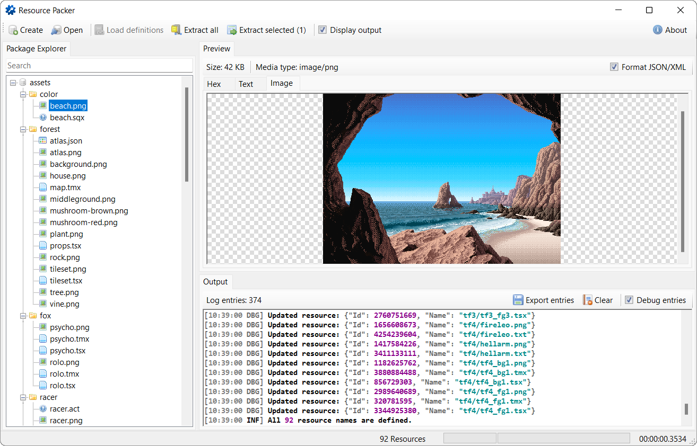
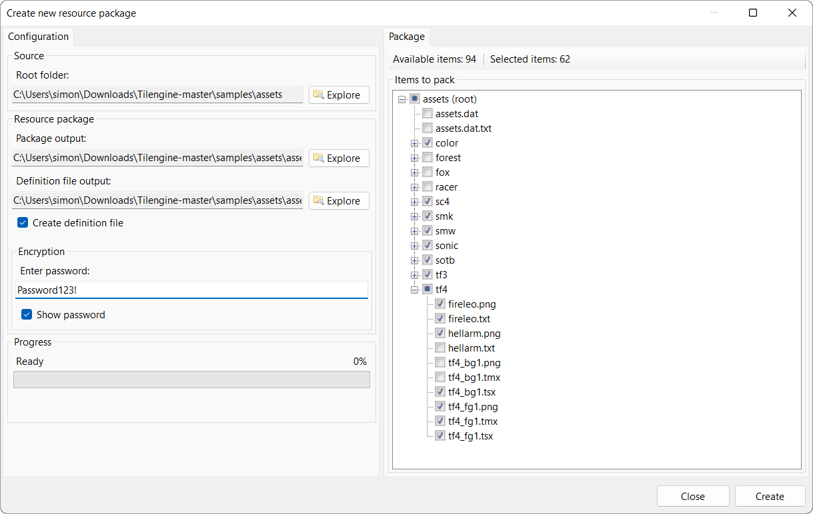

# ResourcePackerGUI

ResourcePackerGUI is a graphical user interface application based on the ResourcePacker command-line tool.
ResourcePacker is a general purpose asset packager with optional AES-128 encryption to protect your game data. It integrates seamlessly with 
[Megamarc's Tilengine](https://github.com/megamarc/Tilengine), which has built-in support for it.

## Archive note
This project is no longer maintained due to lack of time and motivation. You are welcome to fork this repository or use the code
under the **MIT License** , which grants you the rights to use, copy, modify, merge, publish, distribute, sublicense, and/or sell
copies of the software without restriction, as long as you include the copyright notice and the permission notice in all copies or
substantial portions of the software .

## Features

- Create a package, optionally with AES-128 encryption, and to choose which files to include or exclude from the package. 
- Create a file list with a package, or just the package.
- Preview resources from inside a package, with a hex view, text view, or image view.
- Reconstruct a folder structure from the entry IDs and a provided file list.
- Extract all resources from a package, or just a selected amount, to a folder of your choice.
- Preview or extract an existing package without a file list. The IDs are used as the file names, where the extensions are determined by the MIME type based on its contents.

## Screenshots

## Licenses

- Provided under the [MIT License](LICENSE)
